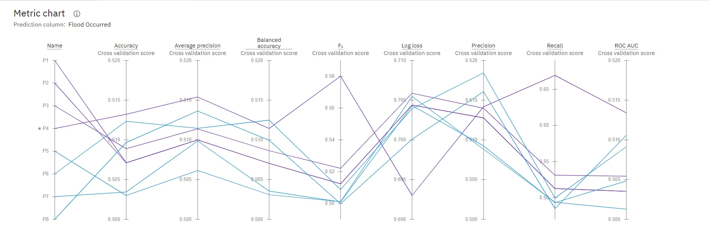

# IndiaFlood Navigator: Detailed Risk Analysis and Forecasting

## Project Overview

**IndiaFlood Navigator** aims to enhance flood risk predictions in India using advanced machine learning techniques. Leveraging IBM Watson Studio and IBM AutoAI, this project analyzes comprehensive datasets to provide accurate flood forecasts, improving flood preparedness and response strategies.

## Key Features

- **Data Integration:** Utilizes historical flood data, meteorological information, and real-time updates.
- **Machine Learning:** Implements Snap Random Forest Classifier Algorithm with enhancements like HPO-1, FE, and HPO-2.
- **Prediction Accuracy:** Achieved an accuracy of 0.513 in predicting flood risks.
- **User Interface:** Provides real-time flood risk forecasts and analysis through a web or mobile application.

## Data

The dataset includes:
- Latitude
- Longitude
- Rainfall (mm)
- Temperature (°C)
- Humidity (%)
- River Discharge (m³/s)
- Water Level (m)
- Elevation (m)
- Land Cover
- Soil Type
- Population Density
- Infrastructure
- Historical Floods
- Flood Occurred
  
The dataset has been uploaded to the repository and can be found in the [flood_risk_dataset_india](flood_risk_dataset_india.csv).

## Installation

1. Clone the repository:
    ```bash
    git clone https://github.com/yourusername/IndiaFlood-Navigator.git
    ```

2. Navigate to the project directory:
    ```bash
    cd IndiaFlood-Navigator
    ```

3. Install the required Python packages:
    ```bash
    pip install -r requirements.txt
    ```
# Output Images

The project includes visualizations of flood risk predictions and model performance. Sample output images are provided in the `Output Images/` directory:
- **Flood Prediction:** It showing predicted flood across different regions.
  
- **Model Performance Graphs:** Graphs displaying accuracy, error metrics, and feature importance.
  
  
  

## Usage

1. Ensure you have IBM Watson Studio and IBM AutoAI set up.
2. Load the dataset and configure the model parameters as described in `config.yaml`.
3. Run the main script to train the model and generate predictions:
    ```bash
    python main.py
    ```

4. Access the results through the user interface.

## Future Enhancements

- Incorporate more real-time environmental data.
- Explore advanced machine learning and deep learning models.
- Expand geographical coverage and improve user interface.
- Integrate with disaster management systems for real-time alerts.

## Contributing

Contributions are welcome! Please fork the repository and submit a pull request with your improvements or fixes.

## License

This project is licensed under the MIT License. See the [LICENSE](LICENSE) file for details.

## Acknowledgements

- IBM SkillsBuild
- Edunet Foundation
- Kaggle for providing the dataset

## Contact

For any questions or feedback, please contact [omhase8585@gmail.com](omhase8585@gmail.com).
